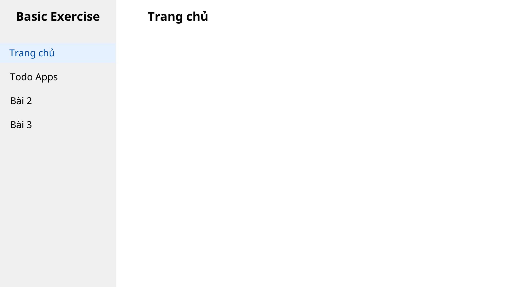

# Bài tập: Tạo layout

## Giới thiệu:

Đây là dạng bài tập cơ bản (chắc là gần nhất) mà một người học VueJs, AngularJs hay ReactJs sẽ phải trải qua

## Mô tả:

- Tạo một component `sidebar` với một list menu bao gồm `Trang chủ` và tên của các bài tập sẽ làm sau này
- Tạo các router tương ứng với từng menu
- Nếu đang ở router nào thì `active` menu đó sáng lên và tiêu đề phần thân trang cũng sẽ thay đổi

### Yêu cầu:

- Khởi tạo UI/UX giống với hình ảnh trên (tương đối thôi)
- Sử dụng kết hợp giữa các component cha-con
- Sử dụng `vue-router` để tạo router cho các menu
- `List menu` sẽ sử dụng mảng để `v-for` ra chứ không được fix cứng trên template
- Nếu `name` của `menu` trùng với `name` của `router` hiện tại thì thêm class `active` cho menu đó và hiển thị như hình ảnh
