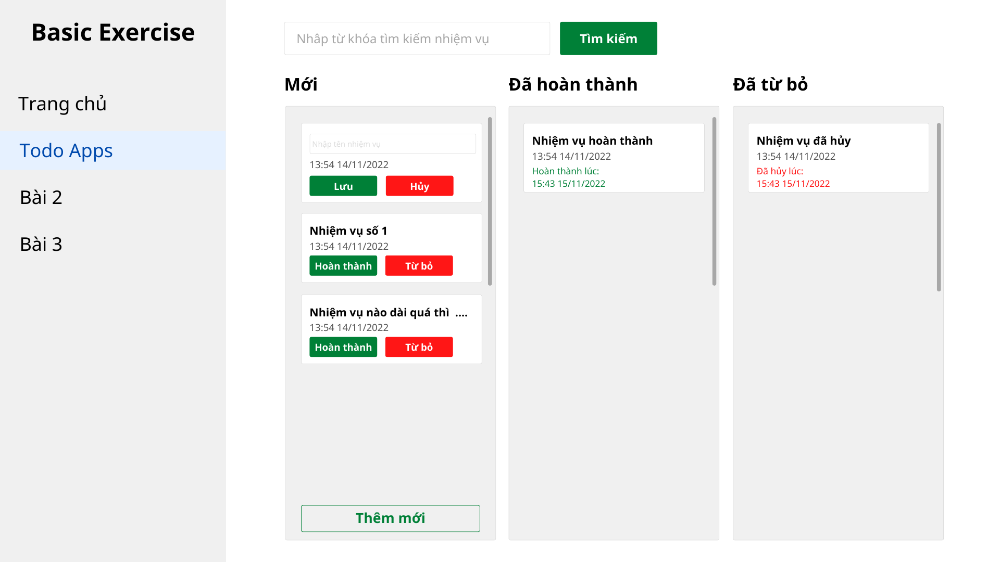

# Bài tập: Todos App

## Giới thiệu:

Đây là dạng bài tập cơ bản (chắc là gần nhất) mà một người học VueJs, AngularJs hay ReactJs sẽ phải trải qua

## Mô tả:

- Sử dụng `layout` của bài trước
- Click vào menu `Todo App`
- Khởi đầu với 3 cột trống
- Sau khi bấm vào nút `Thêm mới` ở dưới cột 1 thì sẽ xuất hiện một `Item todo` với ô input cho phép nhập tên của `Nhiệm vụ`
- Khi xuất hiện Item để nhập trên, nếu chưa bấm `Lưu` thì `disabled` nút `Thêm mới` đi, không cho click nữa
- Khi bấm `Hủy` thì sẽ không lưu `Nhiệm vụ` đó và mở `active` nút `Thêm mới` lên
- Khi bấm `Lưu` thì `Item Todo` lúc này sẽ hiển thị giống như hình ảnh của các `Item` bên dưới
- Phần `thời gian` ở dưới tên sẽ là thời gian hiện tại mỗi khi thực hiện một hành động nào đó được convert dưới định dạng `giờ:phút ngày/tháng/năm`
- Đối với các `Item Todo` sau khi tạo, nếu bấm vào nút `Hoàn thành` thì Item đó sẽ được chuyển sang cột ở giữa với hiển thị như đã thiết kế, nếu bấm `Từ bỏ` thì chuyên sang cột thứ 3
- Nếu tên Item dài quá thì dùng ...
- Đối với ô `Tìm kiếm` thì sau khi nhập từ khóa tìm kiếm, tất cả các item bên dưới sẽ filter theo từ khóa đó (Chỉ hiển thị các item có tên trùng với từ khóa tìm kiếm)
- Nếu mỗi cột có quá nhiêu Item gây tràn trang thì sử dụng thanh scroll cho riêng từng cột

### Yêu cầu:

- Khởi tạo UI/UX giống với hình ảnh trên (tương đối thôi)
- Sử dụng kết hợp giữa các component cha-con
- Sử dụng `props` và `emits` để binding - truyền dữ liệu qua lại giữa các components
- Sử dụng `vuex` để lưu trữ data thay vì sử dụng data Local của từng component (Nâng cao, làm sau khi học vuex)
