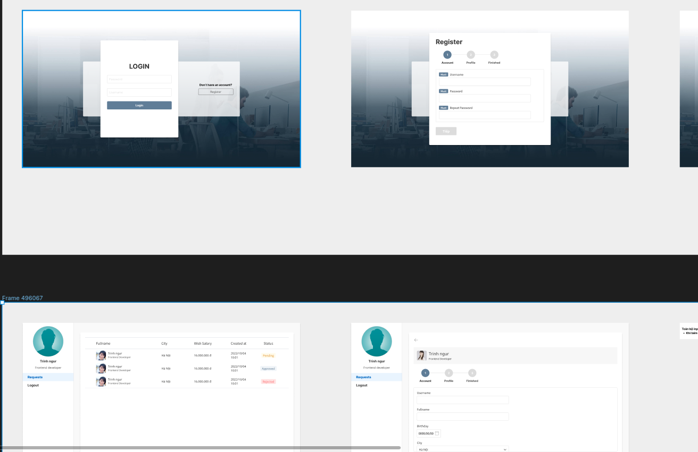

# Bài tập: Request Form System

## Giới thiệu:

Link figma:

### https://www.figma.com/file/e2ObzusmlN5vtujSjk0u1M/Request-form-system?node-id=2%3A38

## Mô tả:

- Hệ thống sẽ có 2 đối tượng sử dụng: Người dùng và Admin
- Nếu đã có tài khoản đăng ký thì người dùng có thể đăng nhập vào hệ thống
- Nếu chưa có tài khoản thì người dùng bấm vào nút Đăng ký, sau đó tiền hành nhập các trường thông tin rồi submit vào hệ thống
- Khi người dùng khác đăng nhập thì có thể thấy các form do người dùng khác gửi vào hệ thống và thực hiện các hành dộng như Approve hoặc Reject

### Yêu cầu:

- Mọi người tạo 1 app firebase chung rồi add những người còn lại vào rồi chia sẻ kết nôi tới app đó. Tức là mọi người sẽ chỉ làm việc trên một database duy nhất
- Sử dụng Firebase Storage để lưu trữ file
- Sử dụng Firebase Realtime Database để lưu trữ dữ liệu
- Tạo sẵn một tài khoản admin/admin trên đó dùng để Approve form lần đầu tiên
- Làm css `chuẩn design 99.99%` nhé, không sai một li nào
- Chỉ cần làm màn desktop, chưa cần làm responsive cho mobile
- Validate nhìn trên ảnh: required hoặc max-length, với inputText thì mặc định max-length là 255 kí tự
- Khởi tạo các component như Loading, Toast - `không dùng thư viện`
- Form nào được Approve thì mới có thể đăng nhập bằng thông tin đã đăng ký
- Cấu trúc thư mục sẽ tạo ra một thư mục `services` để viết các hàm thao tác với `firebase database`, từ actions store sẽ gọi tới đó (giống như gọi API)
- Nếu đã đăng nhập thì mới đc phép truy cập vào trang chủ và các trang xem form, không thể vào trang login
- Ngược lại nếu chưa đăng nhập thì mới vào được trang Login và không thể vào các trang còn lại
- Đơn nào có trạng thái `pending` thì hiển thị đầy đủ cả 2 button
- Đơn nào có trạng thái `approved` hoặc `rejected` thì ẩn cả 2 nút đi
- Từ trang admin nhìn vào form thì chỉ ở trạng thái `readonly`
- `Mở rộng:` Sử dụng Firebase messaging để bắn Notify đến cho người dùng biết đơn của mình được Approve hay Reject
